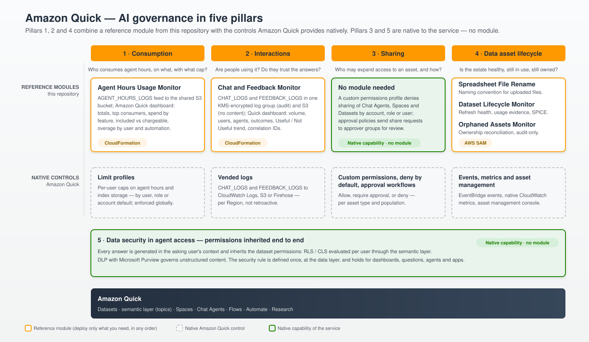

# Amazon Quick — AI Governance

Deployable, self-contained reference modules for governing [Amazon Quick](https://aws.amazon.com/quick/) at scale — consumption visibility, interaction auditing, and data-asset lifecycle — together with the guidance that connects them to the controls Amazon Quick already provides natively, sharing controls included.

Each module is independent: its own [AWS CloudFormation](https://aws.amazon.com/cloudformation/) or [AWS SAM](https://aws.amazon.com/serverless/sam/) template, `apply` / `remove` helper scripts, and a README covering prerequisites, parameters, cost, and teardown. Adopt only what you need, in any order.

> [!WARNING]
> **Sample code — review and adapt before production use.** The modules in this repository are a
> reference implementation published to show how an organization can govern Amazon Quick from its own
> AWS account. They are not an AWS service and are not supported by AWS. Before deploying them where
> production decisions depend on them, review every IAM policy, encryption setting and template default
> against your own security, privacy and compliance requirements, and test them in a non-production
> account first. See [Disclaimer](#disclaimer).

## Why govern Amazon Quick

Amazon Quick lets teams build custom Chat Agents without code, ask natural-language questions over governed datasets, run deep research, and automate workflows — in the browser, on the desktop, and on mobile. When that adoption moves from a pilot to dozens of users — and, in large organizations, to hundreds or thousands — the question for technology leadership changes from "does it work?" to "how do we scale with cost predictability, data security, and auditability?". The signs that the question has arrived are familiar: the invoice that surprises because of a scheduled automation nobody was watching; the commercial agent shared with people who should not see those numbers; the security committee's doubt — "what if the agent answers what the user could not see?" — with no documented answer; nobody able to say how many licenses are really used, or whether people trust the answers; and the assets left without an owner after an offboarding.

Answering that before it becomes an incident is the AI governance agenda — and it is not a brake on adoption; it is what makes adoption sustainable. Organizations that can see who consumes what, audit interactions, control how access expands, and keep every answer within the data permissions users already have can open the technology to more teams, faster, with less friction with security, privacy, and finance.

This repository organizes that agenda into five pillars. Pillars 1, 2 and 4 combine native Amazon Quick controls with the reference modules published here. Pillars 3 and 5 need no module: sharing is governed end to end by Amazon Quick's own controls (custom permissions, deny by default, approval workflows), and data security in agent access is a property of the Amazon Quick architecture itself — the most important point to bring to a security review.

| Pillar | Question it answers | Native Amazon Quick capability | Reference module in this repository |
|---|---|---|---|
| 1 · Consumption | Who consumes agent hours, on which feature, and with what cap? | [Limit profiles](https://docs.aws.amazon.com/quick/latest/userguide/limit-profiles.html) (per-user caps on agent hours and index storage) | [Agent Hours Usage Monitor](./governance-agent-hours-monitor/README.md) |
| 2 · Interactions | Are people using it? Do they trust the answers? What is failing? | [`CHAT_LOGS` and `FEEDBACK_LOGS` vended logs](https://docs.aws.amazon.com/quick/latest/userguide/monitoring-cloudwatch-logs.html) | [Chat and Feedback Monitor](./governance-chat-feedback-monitor/README.md) |
| 3 · Sharing | Who may expand access to an asset, and how? | [Custom permissions](https://docs.aws.amazon.com/quick/latest/userguide/custom-permissions.html) (sharing restrictions per asset type, [deny by default](https://docs.aws.amazon.com/quick/latest/userguide/custom-permissions-governance.html)) and [approval workflows](https://docs.aws.amazon.com/quick/latest/userguide/approval-workflows.html) | — (native capability) |
| 4 · Data asset lifecycle | Is the asset estate healthy, still in use, and still owned? | [EventBridge events](https://docs.aws.amazon.com/quick/latest/userguide/events-integration.html), native CloudWatch metrics, and the [asset management console](https://docs.aws.amazon.com/quick/latest/userguide/manage-qs-assets.html) | [Spreadsheet File Rename](./governance-spreadsheet-file-rename/README.md) · [Dataset Lifecycle Monitor](./governance-dataset-lifecycle-monitor/README.md) · [Orphaned Assets Monitor](./governance-orphaned-assets-monitor/README.md) |
| 5 · Data security in agent access | Does the agent respect each user's data permissions? | [RLS](https://docs.aws.amazon.com/quick/latest/userguide/restrict-access-to-a-data-set-using-row-level-security.html) / [CLS](https://docs.aws.amazon.com/quick/latest/userguide/restrict-access-to-a-data-set-using-column-level-security.html) inherited through the semantic layer · [DLP with Microsoft Purview](https://docs.aws.amazon.com/quick/latest/userguide/data-loss-prevention.html) | — (native capability) |

<p align="center">
  
</p>

## Modules

| Module | Pillar | What it does | Deploy with | Needs the foundation |
|---|---|---|---|---|
| [Agent Hours Usage Monitor](./governance-agent-hours-monitor/README.md) | 1 | Delivers the `AGENT_HOURS_LOGS` feed to the shared analytics bucket and ships an Amazon Quick dashboard: total hours, top consumers, spend by feature, license-covered vs. chargeable, and overage by feature, user, and automation. | CloudFormation | yes |
| [Chat and Feedback Monitor](./governance-chat-feedback-monitor/README.md) | 2 | Delivers `CHAT_LOGS` and `FEEDBACK_LOGS` to one KMS-encrypted log group (the content audit trail) and a field-minimized copy to the shared analytics bucket, and ships an Amazon Quick dashboard: message and conversation volume, active users in the period and the most active ones, most-used agents (friendly names refreshed on every agent rename), response outcomes, Useful / Not Useful trend with reasons, and an audit trail with correlation IDs. | CloudFormation | yes |
| [Spreadsheet File Rename](./governance-spreadsheet-file-rename/README.md) | 4 | Renames any dataset created from an uploaded spreadsheet with a standard prefix (`xls-` by default) within seconds, via an EventBridge → Lambda automation, with no change to the upload experience. | AWS SAM | no |
| [Dataset Lifecycle Monitor](./governance-dataset-lifecycle-monitor/README.md) | 4 | Fleet-wide dataset health without co-owning datasets: last sync status with typed failure reason, sync duration (last vs. average), SPICE capacity with an estimated cost signal, and last observed use with confidence labels — evidence from dashboards, CloudTrail, topics, and Chat Agent citations (`CHAT_LOGS`) — with SNS failure alerts, snapshots in the shared analytics bucket and an Amazon Quick dashboard. | AWS SAM | yes |
| [Orphaned Assets Monitor](./governance-orphaned-assets-monitor/README.md) | 4 | Daily read-only reconciliation of every asset's owner grants (datasets, dashboards, analyses, data sources, folders, spaces, agents, topics) against the Quick user/group inventory: flags orphaned and missing-owner assets (HIGH), single-owner assets (bus factor 1), and recoveries, with SNS alerts. Audit-only — ownership transfer stays a human decision. Snapshots in the shared analytics bucket and an Amazon Quick dashboard. | AWS SAM | yes |
| [Analytics Foundation](./governance-analytics-foundation/README.md) | shared | Once-per-Region prerequisites for the Amazon Quick dashboards: the shared analytics bucket every module writes into (one prefix per module), a Glue database, an Athena workgroup, the Quick data source, and the IAM grant that lets Quick read the data — no console step. | CloudFormation | is the foundation |

The four monitoring modules visualize in Amazon Quick: each ships a Quick dashboard that its `apply` script deploys together with the module, over data in one shared analytics bucket. Alerting, in the modules that raise it, stays operational — CloudWatch alarms and SNS — and the conversation audit trail stays in CloudWatch Logs. See [Deployment options](#deployment-options).

## Pillar 1 — Visibility and control of consumption

AI features in Amazon Quick — Quick Research, Flows, Automate, the desktop assistant, custom apps, and artifact generation — consume **agent hours**, the metered unit of the subscription. With the desktop and mobile apps generally available and agents that keep running in the cloud after the laptop is closed, part of that consumption happens with nobody watching: a scheduled task debits hours on every run. The pricing model has three components every adoption budget must cover: the per-user subscription, the per-account infrastructure fee of the enterprise subscriptions, and variable consumption beyond the monthly allowance included per user. The two enterprise subscriptions differ by design here: in **Professional** the agent-hour allowance is a hard cap — there is no overage; in **Enterprise** usage beyond the allowance is billed per second at a single rate. Index storage beyond the pooled allocation is billed per GB. See [Amazon Quick pricing](https://aws.amazon.com/quick/pricing/) for current values and conditions. Anyone accountable for the budget needs three answers: who is consuming, on which feature, and how much of it is chargeable overage?

**Native control.** The built-in usage analytics aggregate consumption by subscription tier, which is enough to track the whole but not to hold teams and users accountable. For enforcement, [limit profiles](https://docs.aws.amazon.com/quick/latest/userguide/limit-profiles.html) let an administrator define reusable per-user caps on agent hours per billing cycle and on index storage, assigned to individual users, to a role (Author or Reader), or as the account default — the most specific assignment wins. When a user reaches 100% of a cap, new agent invocations (or new uploads and knowledge base ingestions, for storage) are blocked until the next billing cycle. Existing content is always preserved, enforcement is global across Regions, and each user can follow their own consumption in the *My usage* widget.

**Reference module.** The [Agent Hours Usage Monitor](./governance-agent-hours-monitor/README.md) provisions delivery of the `AGENT_HOURS_LOGS` vended-log feed — the granular source the console does not expose — to the shared analytics bucket and ships an Amazon Quick dashboard — Direct Query over Athena, no SPICE and no refresh schedule — with total hours for the period, top consumers, consumption trend by feature, included vs. extra hours, and the overage broken down by user and by automation. Every chargeable hour has an owner: interactive events are attributed to `user_arn`, and scheduled or deployed automations to the resource that ran them. The same S3 data serves downstream analysis in Athena or Grafana, including joins with groups and cost centers for internal chargeback.

**Outcome.** Predictability in two layers: the native cap prevents a single user from exhausting the shared index capacity or generating unexpected agent-hour overage, and the monitor answers what the cap cannot — who consumes, on what, and with what trend. The module publishes no alarm of its own: for an alert when the month's aggregate consumption approaches what was contracted, set a Quick threshold alert on the dashboard's monthly KPI or run an Athena check over the delivered data (see the module README).

## Pillar 2 — Interaction audit and response quality

The next questions from any adoption committee are about usage and quality: are people actually using it — and how many of the contracted licenses show real activity in the month? Do they trust the answers? What is being blocked or left unanswered? Amazon Quick emits two vended-log feeds for this — `CHAT_LOGS` (messages, responses, and status) and `FEEDBACK_LOGS` (Useful / Not Useful ratings with reasons and comments) — documented in [Monitoring Amazon Quick using CloudWatch Logs](https://docs.aws.amazon.com/quick/latest/userguide/monitoring-cloudwatch-logs.html). The same delivery mechanism also serves `AGENT_HOURS_LOGS` (Pillar 1), `DLP_LOGS` (Pillar 5), `AGENT_METADATA_LOGS`, `INDEX_USAGE_LOGS`, and `KB_FILE_SYNC_LOGS`.

**Reference module.** The [Chat and Feedback Monitor](./governance-chat-feedback-monitor/README.md) delivers both feeds to a single encrypted log group (the content audit trail) and, without prompts, responses or comments, to the shared analytics bucket, and ships the Amazon Quick dashboard: message and conversation volume, active users in the period (the base to compare against contracted licenses) and the most active ones, most-used agents (friendly names refreshed on every agent rename), response status (success, blocked, no answer), sentiment trend with the reasons behind negative ratings, and an audit trail whose correlation IDs (`conversation_id`, `user_message_id`, `system_message_id`) tie a question, its response, and its rating together — essential during investigations.

**Two points for leadership.** First, conversation logs contain prompts and responses — potentially sensitive data. The module encrypts the log group with a dedicated AWS KMS key by default and tags it `DataClassification=Sensitive`, but controlling who can read those views, and complying with privacy law (GDPR, Brazil's LGPD, and similar) and internal employee-monitoring policies, remains the organization's responsibility: involve privacy and legal teams before exposing per-user rankings. Second, vended-log delivery is **per Region and not retroactive**: enable it early, in every Region with Amazon Quick activity, because history before the delivery was configured cannot be recovered.

**Outcome.** Measurable adoption and quality — how many licenses are really used, which agents deserve investment, where answers fail — with an audit trail that keeps conversation content encrypted and access-restricted.

## Pillar 3 — Sharing and permission controls

Democratizing agent creation does not mean democratizing their distribution. A well-built Chat Agent over commercial data is a valuable asset — and sharing it with the wrong audience expands access to that asset. Amazon Quick's [custom permissions](https://docs.aws.amazon.com/quick/latest/userguide/custom-permissions.html) deny specific capabilities without stopping people from working.

**Native control.** A [custom permissions profile](https://docs.aws.amazon.com/quick/latest/userguide/custom-permissions.html) is a scope-down policy: it restricts capabilities a role already has and never grants new ones. The profile editor (*Manage Account*, *Permissions*, *Custom permissions*) lists one sharing restriction per asset type — *Share chat agents*, *Share spaces*, *Sharing datasets*, *Sharing dashboards*, *Sharing analyses*, *Sharing data sources*, *Share all knowledge bases*, *Share apps*, *Share skills with individuals*, and the *Share action* of each connector — so an administrator denies exactly the shares the organization wants centralized while leaving creation and use untouched. The profile is assigned to the whole account, to a role (for example, all Authors), or to specific users, and the most specific assignment wins; the console's *Check permissions* shows which profile is effective for any user. [Deny by default](https://docs.aws.amazon.com/quick/latest/userguide/custom-permissions-governance.html) extends the same profile to AI capabilities that do not exist yet: restrict the AI category once and every new AI capability arrives denied for those users until an administrator allows it. The same profiles can be created and assigned through the Amazon Quick API and AWS CLI, called against the account's Quick capacity Region. Users keep creating and consuming governed content, but widening an audience becomes a decision of the central team.

**Be clear about the limits.** A sharing restriction blocks *future* shares; it does not revoke shares already granted — remediating existing shares is separate work that changes live access and deserves its own review. Denying sharing is not complete leak prevention either: exports and downloads need complementary controls (the same profile can deny CSV, Excel and PDF exports and printing). Assignment is per account, role, or user — not per group (use a role, or [automate user-level assignments](https://aws.amazon.com/blogs/machine-learning/automate-user-level-custom-permissions-for-amazon-quick/)). One terminology note avoids confusion: the documentation labels custom permissions, approval workflows, and RLS / CLS as *Enterprise Edition* features — the QuickSight-era name of the Amazon Quick enterprise account provisioned from the AWS console — which is unrelated to the per-user Enterprise subscription; what does require the Enterprise subscription is administering these controls, the Admin Pro role.

**Deny is not the only posture.** Amazon Quick's [approval workflows](https://docs.aws.amazon.com/quick/latest/userguide/approval-workflows.html) (opt-in) route share requests for Spaces, knowledge bases (synced from sources such as SharePoint, OneDrive, and Confluence), and custom Chat Agents to designated approver groups — existing identity groups from AWS IAM Identity Center, IAM federation, or Active Directory — before the recipient receives access. Every submit, approve, deny, and revoke event is recorded in AWS CloudTrail. Two design details matter to risk committees: an approver can test a Chat Agent before deciding, running it in the creator's context without gaining direct access to the underlying data sources (Pillar 5 in action); and an agent can be approved as a package — the agent and its dependencies (knowledge bases, connectors, Spaces) in one all-or-nothing decision, with the full dependency list visible to the approver. Note that the approver group keeps viewer-level access to the asset after the decision until the asset owner removes it.

In practice the organization gets a three-position scale per asset type and population: **allow**, **require approval**, or **deny** — and all three are native: a custom permissions profile for the most restrictive position, an approval policy for the governed middle ground, nothing to deploy from this repository. Earlier releases of this repository shipped a *Block Sharing* module that created and assigned such a profile through the Quick APIs; it was retired in favour of the native controls above. If you deployed it, the profile (`quick-governance-block-sharing-profile` by default) and its assignment remain in your account and keep working like any other custom permissions profile: manage them from the console, or detach and delete them with `aws quicksight delete-account-custom-permission` (or the role or user equivalent) followed by `aws quicksight delete-custom-permissions`, both against the Quick capacity Region (if you used the module's CloudFormation path, detach the assignment and then delete the `quick-governance-block-sharing` stack).

## Pillar 4 — Data asset health and lifecycle

The quality of an agent's answers is bounded by the quality of the data behind it. At scale the dataset estate grows fast — one-off spreadsheet uploads coexist with governed pipelines — and the operational question becomes: what do we have, what is healthy, what is still used — and who still owns it? Three modules address this pillar.

**[Spreadsheet File Rename](./governance-spreadsheet-file-rename/README.md)** automates a naming convention. When someone creates a dataset by uploading a spreadsheet, Amazon EventBridge captures the [dataset-created event](https://docs.aws.amazon.com/quick/latest/userguide/events-integration.html) and an AWS Lambda function renames the asset within seconds with a standard prefix (`xls-` by default; format and prefix are configurable), with no change to the uploader's experience. Administrators can tell ad hoc data from pipeline data at a glance. Governance by convention — automatic and invisible to the user.

**[Dataset Lifecycle Monitor](./governance-dataset-lifecycle-monitor/README.md)** gives the fleet view the console does not offer an enterprise administrator: the last sync status of every dataset with the typed failure reason, refresh duration (last vs. average, full vs. incremental), SPICE capacity consumed with an estimated cost signal, and the last observed use — always with a confidence label, because the available usage evidence is a signal, not a verdict. Usage evidence spans dashboard views, CloudTrail queries, topic lineage, and — when the Chat and Feedback Monitor is deployed — resources cited by Chat Agents in `CHAT_LOGS`, covering the agent consumption path that dashboard telemetry alone misses. New refresh failures raise Amazon SNS alerts. The design matters for the operating model: all collection uses IAM-authorized read-only APIs, so the governance team sees the operation without becoming co-owner of anyone's dataset or gaining access to anyone's data. The module is strictly observational: it never deletes assets, disables schedules, or changes permissions.

**[Orphaned Assets Monitor](./governance-orphaned-assets-monitor/README.md)** closes the ownership gap: Amazon Quick does not automatically transfer assets when a user is removed — the `DeleteUser` API runs no cleanup at all, and identity-provider removals only park the user in the *Inactive users* list pending review. A daily read-only scan reconciles every asset's owner grants against the current user and group inventory and flags the risk ladder: assets with no owner grants or only missing principals (HIGH — verified live: after a user is deleted the dangling grant survives briefly and is then purged, leaving an empty permission document), assets kept alive by a single active owner (the bus-factor-1 list to review before offboarding), and recoveries once ownership is restored. Findings carry evidence and confidence, are never closed after a partial scan, and remediation deliberately stays manual in the Quick asset management console — the module is audit-only by design. Cross-reading it with the Dataset Lifecycle Monitor prioritizes transfers by usage: an orphaned asset that feeds active agents is urgent; an orphan nobody uses is a candidate for archiving.

The combined result is a curated, explainable estate — exactly the foundation the agents in the next pillar depend on.

## Pillar 5 — Data security in agent access: permissions inherited end to end

This is the pillar that raises the most doubt in security reviews: "if an AI agent answers any question about the data, doesn't it become a shortcut around permissions?" In Amazon Quick the answer is no — provided agent access to data is built through the governed path: datasets with a semantic layer.

The path: structured data enters as **Datasets**, assets with their own permissions. On top of them the semantic layer adds meaning and structure — dataset enrichment describes the business meaning of each field, and [multi-dataset topics](https://aws.amazon.com/blogs/machine-learning/build-a-unified-semantic-layer-across-datasets-with-multi-dataset-topics-in-amazon-quick) define the relationships between datasets once, so the service performs the joins at query time. These assets are gathered in **Spaces** and connected to custom **Chat Agents**, which answer natural-language questions by generating queries over the datasets.

**The central point: the agent does not create a parallel path to the data.** Every answer is generated in the context of the user who asks and inherits the permissions defined on the datasets — including [row-level security (RLS)](https://docs.aws.amazon.com/quick/latest/userguide/restrict-access-to-a-data-set-using-row-level-security.html) and [column-level security (CLS)](https://docs.aws.amazon.com/quick/latest/userguide/restrict-access-to-a-data-set-using-column-level-security.html). A sales representative asks the commercial agent "what were my sales this quarter?" and, with RLS on the dataset, receives only the rows for their own accounts and region — not the whole sales force. A colleague in another region asks the same agent the same question and gets their own slice; the sales director, with a broader rule, sees the consolidated figure. One question, three answers — each limited to what that user could already see. With CLS, restricted columns (margin, cost, compensation) are simply not available to anyone without access to them. Multi-dataset topics reuse the permissions of the datasets they compose: the semantic layer widens what the agent can answer without widening anyone's access.

The architectural implication is the one to bring to an executive committee: **the security rule is defined once, at the data layer, and holds for dashboards, natural-language questions, agents and — since September 2026 — [apps built in Amazon Quick on datasets](https://docs.aws.amazon.com/quick/latest/userguide/connecting-datasets-apps.html), which query the data under the identity of whoever opens them** — instead of being re-implemented (and inevitably forgotten) in agent instructions. Instructions define behavior; permissions define security. A prompt is not an access control. Two precision notes: RLS restricts data *consumers* — dataset owners still see everything, so ownership should stay limited to data roles (Pillar 3 helps contain that group); and RLS / CLS are defined by whoever owns the dataset — an author role, which in Amazon Quick means the Enterprise subscription; for consumers, either enterprise subscription works.

The same principle — no parallel path — extends to unstructured content. Amazon Quick [integrates with Microsoft Purview to enforce data loss prevention (DLP) policies](https://docs.aws.amazon.com/quick/latest/userguide/data-loss-prevention.html): organizations already on Microsoft 365 reuse their existing sensitivity labels (such as *Confidential* or *Highly Confidential*) to control how files are handled in chat, Spaces, and knowledge bases, with Block, Warn, or Allow actions per label and no additional tooling. Two details show the maturity of the design: a default action covers unlabeled files and labels created after setup, and a provider-outage action can be configured fail-closed, blocking ingestion while Purview is unreachable. DLP decisions are emitted as their own `DLP_LOGS` feed, which slots into the monitoring of Pillar 2. For an organization governing data in a Microsoft 365 environment, the information-classification policy starts to apply inside the AI assistant — defined once, enforced on every channel.

**Outcome.** One place to define — and audit — who sees what, valid for dashboards, natural-language questions, agents, and apps. It is the answer the security committee needs to hear before the first agent in production.

There is no module in this repository for Pillar 5 by design: RLS, CLS, and the semantic layer belong in the design of each dataset, maintained by the data teams that own it.

## Getting started

### Prerequisites

- An Amazon Quick subscription in the AWS account and Region you deploy into. Every module targets the deploying account through the `AWS::AccountId` pseudo-parameter — there is no account ID to pass — and cross-account deployment is out of scope. Vended-log delivery requires the enterprise subscriptions (Professional or Enterprise). Administering custom permissions, approval workflows, and limit profiles is an Admin Pro task, and defining RLS / CLS an author task — both Enterprise-subscription roles; the *Enterprise Edition* label in the documentation refers to the account type, not to the per-user subscription (see Pillar 3).
- [AWS CLI v2](https://docs.aws.amazon.com/cli/latest/userguide/getting-started-install.html) authenticated to that account (pass `--profile <name>` to the scripts or set `AWS_PROFILE`).
- [AWS SAM CLI](https://docs.aws.amazon.com/serverless-application-model/latest/developerguide/install-sam-cli.html) for the SAM-based modules (Spreadsheet File Rename, Dataset Lifecycle Monitor, Orphaned Assets Monitor).
- Deployment credentials with CloudFormation, IAM, Lambda, S3, SNS, and CloudWatch permissions as required by each template, plus `quicksight:AllowVendedLogDeliveryForResource` on the Quick account for the two log-based monitors. Amazon Quick APIs and IAM actions still use the `quicksight` namespace.
- For the four monitoring modules: the [Analytics Foundation](./governance-analytics-foundation/README.md) deployed once per Region first. It needs a Quick **user or group ARN** to own the dashboards (it lives in the account's Quick *identity* Region, which can differ from the deployment Region) and `CAPABILITY_IAM`, because it attaches a scoped policy to Quick's service role.

### Deploy and remove a module

Every module follows the same layout and one-command workflow:

```text
governance-<module>/
├── README.md                              prerequisites, parameters, dashboards, cost, teardown
├── cloudformation/<module>.yaml           CloudFormation or SAM template (source of truth)
├── cloudformation/<module>-quick-dashboard.yaml
│                                          the Amazon Quick dashboard (monitoring modules)
├── lambda/                                Python source, SAM modules only (plus a pinned
│                                          requirements.txt where the runtime SDK lacks newer Quick APIs)
└── scripts/
    ├── apply-<module>.sh                  idempotent deploy / update of the module AND its Quick dashboard
    ├── remove-<module>.sh                 teardown of both
    ├── apply-<module>-quick-dashboard.sh  the Quick dashboard alone (monitoring modules)
    └── remove-<module>-quick-dashboard.sh
```

```bash
cd governance-<module>/scripts
./apply-governance-<module>.sh  --region <region> [--profile <aws-cli-profile>]
./remove-governance-<module>.sh --region <region> [--profile <aws-cli-profile>]
```

Each README lists the module-specific flags (for example, the Chat and Feedback Monitor requires an explicit confirmation to delete conversation history, and every monitoring module accepts `--skip-dashboard` and `--foundation-stack`). The templates can also be deployed directly with `aws cloudformation deploy` or `sam deploy`; the monitoring templates then need `AnalyticsBucketName` (the foundation's output).

### Deployment options

Two questions decide everything:

1. **Which modules do you need?** Any subset, in any order. Every module is its own stack; no module depends on another.
2. **Do any of them visualize?** The four monitoring modules (Agent Hours, Chat and Feedback, Dataset Lifecycle, Orphaned Assets) do, in Amazon Quick, and they need the [Analytics Foundation](./governance-analytics-foundation/README.md) deployed **once per Region before them**. Spreadsheet File Rename never needs it.

| You want | Deploy, in this order | Buckets created |
|---|---|---|
| The control module (Spreadsheet File Rename) | the module stack | 0 (+1 SAM artifact bucket, once per account/Region, for the SAM modules) |
| One monitoring module, e.g. Agent Hours | foundation, then `apply-governance-agent-hours-monitor.sh --region <r>` — it deploys the module stack and its Quick dashboard | 3 (foundation: data, Athena results, access logs) |
| Every module | foundation, then each `apply-*.sh` in any order | 3 (+1 SAM artifact bucket) |
| A monitoring module's data for your own tools, no Quick dashboard | foundation, then the module with `--skip-dashboard`; read `<module>/` in the analytics bucket with Athena, Grafana, Datadog… | 3 |

```bash
# the whole estate in one Region
governance-analytics-foundation/scripts/apply-governance-analytics-foundation.sh --region <r> --quick-principal-arn <arn>
governance-agent-hours-monitor/scripts/apply-governance-agent-hours-monitor.sh     --region <r>
governance-chat-feedback-monitor/scripts/apply-governance-chat-feedback-monitor.sh --region <r>
governance-orphaned-assets-monitor/scripts/apply-governance-orphaned-assets-monitor.sh   --region <r>
governance-dataset-lifecycle-monitor/scripts/apply-governance-dataset-lifecycle-monitor.sh --region <r>
governance-spreadsheet-file-rename/scripts/apply-governance-spreadsheet-file-rename.sh --region <r>
```

What the monitoring modules share, and what they keep:

- **One shared analytics bucket per Region**, one prefix per module (`agent-hours/`, `chat-feedback/`, `dataset-lifecycle/`, `orphaned-assets/`). The collectors keep their working state under `<module>/state/` in the same bucket — outside every Glue table location, never expired by the bucket's lifecycle rules, and explicitly denied to Quick's service role. The modules create no buckets of their own.
- **Freshness.** The Quick datasets are Direct Query over Athena, so every dashboard load reads the bucket: data is visible seconds after a vended-log delivery or a collector run. A dashboard may be deployed before its data exists; it shows empty until the first delivery or scan.
- **Operations stay in CloudWatch** where they belong: the collectors publish low-cardinality KPI metrics that drive alarms (new HIGH ownership findings, refresh failures, collector errors), with SNS notifications; the Chat and Feedback log group remains the encrypted audit trail of prompts and responses — content that never enters S3 or Quick.
- **No console steps.** Quick reads the shared bucket through an IAM policy the foundation stack attaches to Quick's service role; the console's *AWS resources* authorization is not needed. Cross-account deployment is out of scope.

### Region matters

- Vended-log delivery (Pillars 1 and 2) is per Region: deploy the monitors in every Region with Amazon Quick activity.
- EventBridge events (Spreadsheet File Rename) fire in the Region where the dataset lives.
- Asset inventories (Dataset Lifecycle Monitor, Orphaned Assets Monitor) are per Region: deploy one stack per Region that holds Quick assets. The Orphaned Assets Monitor discovers the identity Region (users and groups) automatically when it differs from the asset Region.

### Suggested adoption sequence

The five pillars form a simple operating model — with modest team prerequisites. The native controls — permission profiles, approval policies, and limit profiles — need only the Quick administrator, in the console. The modules need a cloud engineer with access to the account: they are independent of each other and deploy with one command each, in the account and Regions where Amazon Quick runs. The platform team or data center of excellence operates the set and administers the native controls, while data teams keep RLS / CLS and the semantic layer as part of each dataset's design.

1. **Pillars 1 and 5 first** — consumption under control, and RLS / CLS defined on the datasets before the first agent reaches production, so answers are limited to what each user is already permitted to see.
2. **Pillar 2 early** — log delivery is not retroactive, so start it before you need the history.
3. **Pillars 3 and 4** as the number of creators and datasets grows — Pillar 3 is configuration in the Amazon Quick admin console, nothing to deploy.

### Four decisions before the first agent in production

For an adoption with dozens of licenses — the point where a pilot becomes a corporate program — the foundation fits in four decisions:

1. **Licenses and cost model.** The enterprise subscriptions come in two per-user tiers, assigned by group in the identity provider: Professional, for those who consume, ask, and create agents and Spaces; and Enterprise, for those who also create datasets, dashboards, and automations, approve and certify assets, and administer the account. The governance in this repository needs Enterprise licenses in three populations — the data owners who define RLS / CLS, the approver groups of Pillar 3, and the administrators who maintain permission and limit profiles; the rest of the organization can stay on Professional. Enterprise is also where agent-hour overage exists, governed by limit profiles. The budget is licenses plus the account's infrastructure fee plus expected overage, with the Pillar 1 monitor as the monthly source of truth — and decide up front whether users may request their own upgrade from Professional to Enterprise and whether that needs administrator approval: it is an account setting (the custom permissions capability *Allow users to upgrade or request upgrades* denies it), and each upgrade raises the cost of that license.
2. **Identity and groups.** Federate users through the corporate identity provider and organize groups that mirror areas and roles: they feed the RLS rules, the approver groups of Pillar 3, and consumption chargeback by cost center. Governance by group scales; governance by user does not.
3. **A governed path for data.** Structured data enters as datasets with RLS / CLS and a semantic layer from day one — that is what makes Pillar 5 hold for every agent created afterwards. Ad hoc uploads stay allowed, but identifiable through the Pillar 4 naming convention: freedom with a label.
4. **Observability and owners from day one.** Enable the log feeds in every Region with activity before the rollout — history cannot be recovered — and name the roles: the platform team answers for the monitors and policies; data owners for RLS / CLS and the semantic layer; each agent creator for what the agent promises to do.

None of these decisions — and none of the five pillars — restricts creation: users keep creating agents, Spaces, and analyses. What is governed is consumption (a cap), distribution (a gate), and data access (inheritance). That separation is what lets adoption scale organically without turning the central team into a bottleneck — and it is what sustains the return-on-investment conversation: the same monitors that control cost measure adoption (active users vs. contracted licenses, hours consumed vs. allowance, questions answered and ratings per agent), so when licenses sit idle the first decision is usually to redistribute them to people who will use them, not to cut the program.

### Cost

Operating cost is on the order of a few US dollars per month for the whole estate: vended-log delivery to S3 and S3 storage in cents, Athena per-query charges for the Quick dashboards (a few small queries per dashboard load, kilobytes scanned at governance volumes), the Chat and Feedback log group's ingestion and storage, a handful of custom metrics and alarms, and Lambda invocations for the collectors. Spreadsheet File Rename is pay-per-use. Glue and the Athena workgroup are free, and Quick itself is priced per user independently of this repository. Each module README breaks down its own cost drivers and defaults (retention, schedules).

## Repository layout

```text
.
├── docs/images/                            diagrams used by the READMEs
├── governance-agent-hours-monitor/         Pillar 1 · CloudFormation
├── governance-chat-feedback-monitor/       Pillar 2 · CloudFormation
├── governance-spreadsheet-file-rename/     Pillar 4 · AWS SAM (Python Lambda)
├── governance-dataset-lifecycle-monitor/   Pillar 4 · AWS SAM (Python Lambda)
├── governance-orphaned-assets-monitor/     Pillar 4 · AWS SAM (Python Lambda)
└── governance-analytics-foundation/        shared · CloudFormation (prerequisite of the four monitoring modules)
```

## Disclaimer

**This repository is sample code, published for reference and evaluation. It is not an AWS service and it is not supported by AWS. You use it at your own risk, and you remain responsible for the governance decisions you make with the data it produces.**

Before relying on any module where production decisions depend on it:

- **You own the security review.** The templates configure IAM roles and policies, KMS encryption, S3 bucket policies and lifecycle rules, Lambda functions and log deliveries. Each module README describes those controls so you can check them against your own requirements; that description is not a compliance claim, and none of it has been assessed against any framework. Review every policy and default — in particular the grant to the Amazon Quick service role, the KMS key policy of the Chat and Feedback log group, and the retention periods — and adapt them to your account.
- **Test in a non-production account first.** The modules read Amazon Quick vended logs and APIs and, in one case, make scoped write calls (renaming spreadsheet datasets). Deploy with the defaults in a sandbox account, confirm the dashboards, alerts and automations behave as you expect, then promote the templates through your own change process.
- **Governance signals, not verdicts.** The monitors report evidence with its source and confidence (for example "last observed use" or "probable deletion of an owner"). Ownership transfers, access revocations and asset deletions remain human decisions; the modules never perform them.
- **You own the cost.** Vended-log delivery, S3, Athena, CloudWatch Logs, alarms and Lambda are billed to your account; Amazon Quick is priced per user independently of this repository. The [Cost](#cost) section and each module README give the drivers and defaults.
- **Privacy and legal.** Conversation content stays in a KMS-encrypted log group and is excluded from the dashboards by default. Involve your privacy and legal teams before widening who can read that content, and before using any of these signals in decisions about individual users.
- **No warranty of any kind.** See [LICENSE](LICENSE).

## Security

See [CONTRIBUTING](CONTRIBUTING.md#security-issue-notifications) for more information.

## License

This library is licensed under the MIT-0 License. See the [LICENSE](LICENSE) file.
